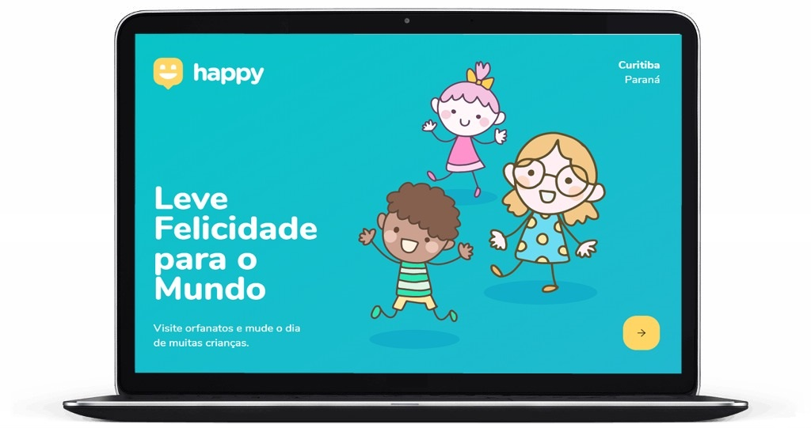
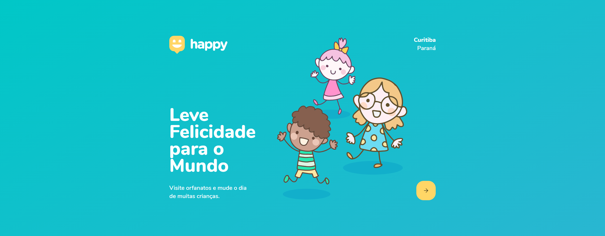
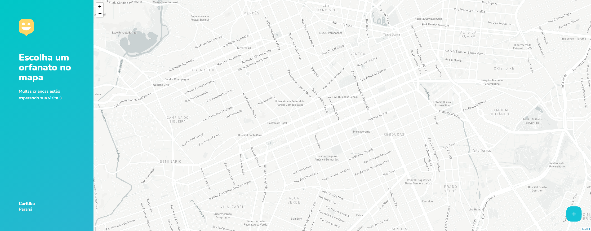

<h1 align="center">
    
</h1>

 

## 💜 Happy - Faça uma criança Feliz! 💜
 

  

## 🚀 Tecnologias

- [Node.js](https://nodejs.org/en/)
- [React.js](https://reactjs.org/)

## 💻 Sobre o Projeto

Projeto que visa conectar você aos orfanatos, localize, visite e ajude orfanatos da sua cidade!

  

  

Este é um projeto desenvolvido durante a **[Next Level Week](https://nextlevelweek.com/)**, realizada pela **[@Rocketseat](https://github.com/Rocketseat)** durante os dias 12 a 18 de Outubro de 2020.

Projeto da [Next Level Week 3.0](https://nextlevelweek.com/).

## 🔖 Layout

Você pode visualizar o layout do projeto através dos links abaixo:

- [Layout Web](https://www.figma.com/file/mDEbnoojksG4w8sOxmudh3/Happy-Web?node-id=0%3A1) 
- [Layout Mobile](https://www.figma.com/file/X27FfVxAgy9f5IFa7ONlph/Happy-Mobile?node-id=0%3A1) 

Lembrando que você precisa ter uma conta no [Figma](http://figma.com/) para acessá-lo.

---

Desenvolvido com 💜 por Bruno Pedroso

